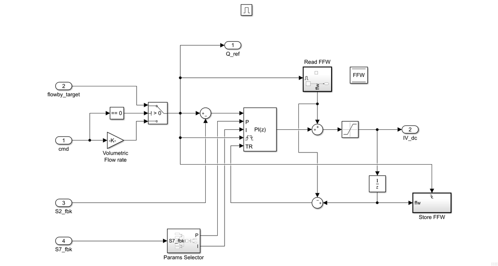

Control Design
==============

The controller has been designed and realized in Simulink and tested within a meaningful subset of the pneumatic circuit implemented in Simscape.

More details can be found in [**`FI5 technical specifications`**](../../design/FI5-specs.pdf).


The Embedded Coder is then used to generate the corresponding code of the controller that can be profitably deployed on the target device.

The controller, whose main architecture is shown below, comprises the following modules:
- Filtering stage
- Pulse generator and autotriggering
- Volume controller
- Pressure controller
- Tidal volume computation
- Tidal volume maximum value computation


## Volume Control Ventilation
The VCV mode is implemented through a PI controller complemented with a autoadaptive feed-forward term. Finally, the controller's gains can be scheduled based on the pressure delivered by PR1 and sensed by S7.



## Pressure Regulated Volume Control
The PRVC mode is implemented through a PI controller complemented with a static feed-forward term. The reference square-wave with high-level PIP is further shaped by a dedicated module that is responsible for providing a given onset step and a smoother minimum-jerk profile towards the final setpoint. Finally, the controller's gains can be scheduled based on the pressure delivered by PR1 and sensed by S7.


### Example of generated main
The following snippet shows how to interface with the generated code.

```c++
#include <stddef.h>
#include <stdio.h>
#include "controller.h"
#include "rtwtypes.h"
#include "zero_crossing_types.h"

static controllerModelClass controller_Obj;// Instance of model class

void rt_OneStep(void);
void rt_OneStep(void)
{
  static boolean_T OverrunFlag = false;

  // Disable interrupts here

  // Check for overrun
  if (OverrunFlag) {
    rtmSetErrorStatus(controller_Obj.getRTM(), "Overrun");
    return;
  }

  OverrunFlag = true;

  // Save FPU context here (if necessary)
  // Re-enable timer or interrupt here
  // Set model inputs here

  controllerModelClass::P_controller_T parameters = controller_Obj.getBlockParameters();
  parameters.Controller_control_mode = 1;  // set IDLE
  controller_Obj.setBlockParameters(&parameters);

  controllerModelClass::ExtU_controller_T inputs;
  inputs.enable = true;
  inputs.S1_Pi = 0.F;        // S1 Pressure [code] (float)
  inputs.S2_Qi = 0.F;        // S2 Flow Rate [code] (float)
  inputs.S3_i[0] = 0.F;      // S3 Pressure [code] (float)
  inputs.S3_i[1] = 0.F;      // S3 Temperature [code] (float)
  inputs.S4_Pi = 0.F;        // S4 Pressure [code] (float)
  inputs.S5_Qi = 0.F;        // S5 Flow Rate [code] (float)
  inputs.S7_Pi = 0.F;        // S7 Pressure [code] (float)
  inputs.params[0] = 50.F;   // Zephyr FS [SLPM] (float)
  inputs.params[1] = 160.F;  // HSC LP FS [mbar] (float)
  inputs.params[2] = 150.F;  // HSC HP FS [psi] (float)
  controller_Obj.setExternalInputs(&inputs);

  // Step the model
  controller_Obj.step();

  // Get model outputs here

  const controllerModelClass::ExtY_controller_T& outputs = controller_Obj.getExternalOutputs();
  outputs.IV_dc;       // CP valve DC command [%] (float)
  outputs.OV_cmd;      // CFB valve ON/OFF command [-] (boolean)
  outputs.Q_ref;       // Target Flow Rate [L/min] (float)
  outputs.P_ref;       // Target Pressure [cmH2O] (float)
  outputs.signals[0];  // S1 Filtered Pressure [cmH2O] (float)
  outputs.signals[1];  // S2 Flow Rate [L/min] (float)
  outputs.signals[2];  // S3 Filtered Pressure [cmH2O] (float)
  outputs.signals[3];  // S3 Temperature [°C] (float)
  outputs.signals[4];  // S4 Filtered Pressure [cmH2O] (float)
  outputs.signals[5];  // S5 Flow Rate [L/min] (float)
  outputs.signals[6];  // S7 Filtered Pressure [cmH2O] (float)
  outputs.signals[7];  // Tidal Volume estimates [L] (float)
  outputs.signals[8];  // Maximum Tidal Volume per 2 cycles [L] (float)
  outputs.signals[9];  // Assisted Ventilation Trigger [-] (float)

  // Indicate task complete
  OverrunFlag = false;

  // Disable interrupts here
  // Restore FPU context here (if necessary)
  // Enable interrupts here
}

int_T main(int_T argc, const char *argv[])
{
  // Unused arguments
  (void)(argc);
  (void)(argv);

  // Initialize model
  controller_Obj.initialize();

  printf("Warning: The simulation will run forever. "
         "Generated ERT main won't simulate model step behavior. "
         "To change this behavior select the 'MAT-file logging' option.\n");
  fflush((NULL));
  while (rtmGetErrorStatus(controller_Obj.getRTM()) == (NULL)) {
    //  Perform other application tasks here
  }

  // Disable rt_OneStep() here

  // Terminate model
  controller_Obj.terminate();
  return 0;
}
```